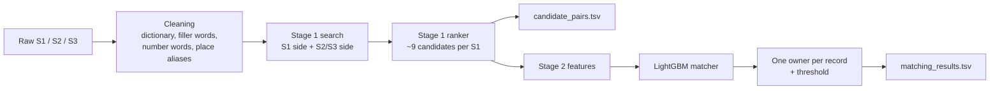

# Business Entity Resolution - Amazon ML Challenge 2026

Find which business records from **Source 2** and **Source 3** are the same real business as each record in **Source 1** (the clean, deduplicated reference). Records share no IDs and are noisy: typos, missing parts, Indian scripts, trade names, reordered addresses, legal-form changes and planted look-alike businesses.

The solution is a two-stage pipeline in one notebook:

1. **Stage 1 - candidate generation (blocking):** for every S1 record, find a short list (~9) of S2/S3 records that almost surely contains all its true matches.
2. **Stage 2 - matching:** score each candidate pair and pick the final matches, tuned for the challenge metric (macro F0.5, precision-heavy).



---

## Contents

- [Results](#results)
- [Quick start](#quick-start)
- [What the data taught us](#what-the-data-taught-us)
- [Stage 1 - cleaning](#stage-1--cleaning)
- [Stage 1 - candidate search](#stage-1--candidate-search)
- [Stage 1 - ranker](#stage-1--ranker)
- [Stage 2 - matching](#stage-2--matching)
- [How we validated (and avoided fooling ourselves)](#how-we-validated-and-avoided-fooling-ourselves)
- [What we tried that did not help](#what-we-tried-that-did-not-help)
- [Key settings](#key-settings)
- [Engineering notes](#engineering-notes)
- [Known limitations and next steps](#known-limitations-and-next-steps)
- [Licences and fair play](#licences-and-fair-play)

---

## Results

All numbers are **local, honest estimates** (scored S1 records were never seen in training; thresholds chosen on other folds). See [How we validated](#how-we-validated-and-avoided-fooling-ourselves).

### Stage 1 (candidate generation)

| Setting | Recall (true pairs in candidates) | Candidates per S1 |
|---|---|---|
| Slice 1 (TN + AZ / Kerala + Rajasthan), 6,000 S1 | 99.88% | 8.7 |
| Slice 2 (Ohio / Gujarat), 6,000 S1 | 99.88% | 8.7 |
| Slice 1, 40,000 S1, saved ranker | 99.84% | 8.7 |
| **Full train data (Kaggle), ~20,000 S1** | **99.40%** (India 99.23%, US 99.51%) | 11.0 |

Every S1 gets at least one candidate. The drop at full size comes from country-wide look-alikes (see [limitations](#known-limitations-and-next-steps)).

### Stage 2 (final matching)

| Training data | Macro F0.5 (5-fold, mean ± std) |
|---|---|
| 6,000 S1 | 0.9762 ± 0.0028 |
| 12,000 S1 (both slices) | 0.9795 ± 0.0015 |
| **40,000 S1** | **0.9817 ± 0.0006** |

At 40,000 S1: pair precision 99.1%, pair recall 96.7%, singletons 0.974. Picking perfectly from the candidates would score 0.9996, so the remaining gap is in stage 2, not stage 1.

---

## Quick start

The notebook `entity_resolution_full.ipynb` runs top to bottom. Change only `STEP` in *Stage 1 – Block 1* and run it three times:

| `STEP` | What it does | Main output |
|---|---|---|
| `'learn'` | Stage 1 on `N_LEARN` train S1 (default 50,000): learns the dictionary, filler words, place aliases and the stage-1 ranker; prints stage-1 recall and missed pairs | `work/stage1/learned/` |
| `'train'` | Stage 1 on `N_TRAIN` *other* train S1 (default 300,000) with the saved ranker, then trains the stage-2 matcher with K-fold by S1 and prints honest F0.5 | `work/stage2/matcher_*` |
| `'test'` | Stage 1 + stage 2 on the full test set, then checks the files against the challenge rules | `work/stage2/output/matching_results.tsv`, `candidate_pairs.tsv` |

### Kaggle

1. Add the dataset as an input. The notebook finds `train_source1.tsv` / `test_source1.tsv` anywhere under `/kaggle/input` by itself and writes to `/kaggle/working/work`.
2. Settings: **Internet on** (missing packages are installed automatically), Accelerator **None** (CPU only).
3. Block 1 prints the three paths it found; check them, then run.
4. To continue from an earlier saved version, add that version's output as an input - the `work` folder is copied back automatically (checkpoints, cleaning cache, learned files).

### Colab

Set `base_path` in Block 1 and keep this layout on Google Drive:

```
amazon-ml-26/
  datasets/train/  train_source1.tsv  train_source2.tsv  train_source3.tsv  train_ground_truth.tsv
  datasets/test/   test_source1.tsv   test_source2.tsv   test_source3.tsv
```

### Rules

- **Do not change settings between `'train'` and `'test'`** - `'test'` loads what `'train'` saved.
- If a run stops, run the same step again: finished countries are loaded from checkpoints.
- Out of RAM: lower `S1_CHUNK`, `SCORE_CHUNK` or `N_LEARN`. Do not use `COUNTRIES` for the test step (every test S1 must be in the output).

### Requirements

`numpy pandas scipy scikit-learn pyarrow lightgbm rapidfuzz anyascii sparse_dot_topn` (optional: `xgboost`).
Tested with lightgbm 4.7.0, rapidfuzz 3.14.6, sparse_dot_topn 1.2.0, scikit-learn 1.8.0, scipy 1.17.1, pandas 3.0.2, pyarrow 25.0.1, xgboost 3.4.1.

---

## What the data taught us

| Fact | Why it matters |
|---|---|
| Train: 2.21M S1, 5.03M S2, 5.29M S3. Test: 1.73M S1 (US 663k, India 810k, **France 259k**), 9.97M S2+S3 | Brute-force comparison is impossible; blocking must scale |
| **Every S2/S3 record belongs to at most one S1** (checked on all 7.64M labelled records) | "One owner" rule: a record goes only to its best S1. Also makes searching *from the S2/S3 side* very effective |
| Matches always share the country | Everything runs country by country |
| Only 5.6% of S1 are singletons; max matches for one S1 is **11** | A top-15 cut never truncates a full match set |
| About **26% of S2/S3 records match no S1** | Many are planted look-alikes (same name, one house-number digit changed) |
| About 23% of Indian S2/S3 names are in Indian scripts (Hindi, Tamil, Malayalam, Gujarati, …) | Letter-by-letter transliteration is not enough ("ईस्ट फाइनेंस" → "ist phainems") |
| France appears only in test; no non-Latin letters, many accents | Rules and features must not depend on country labels |
| Noise adds filler words ("Center", "Services", "the"), titles ("Sri", "Smt", "Dr"), cuts names to the first word, writes names as domains ("maurewilliamscolombier.com"), and uses "X dba Y" / "formerly" | Each pattern gets a dedicated cleaning rule, learned from train pairs where possible |
| House numbers: a **cut-off** number (600 → 60) is usually noise on a true match; a **one-digit change** (13838 → 13841) is usually a look-alike | Dedicated house-number features in stage 2 |

---

## Stage 1 - cleaning

All rules are general language facts or are **learned from train pairs**; nothing looks up external data.

| Step | What it does |
|---|---|
| Transliteration | `anyascii` turns any script into Latin letters |
| **Learned dictionary** | Lines up words of true pairs ("ईस्ट फाइनेंस प्रा. लि." ↔ "East Finance Pvt Ltd") to learn native word → English word. On held-out businesses: 97.7% of native words covered, exact name match 1.4% → 91.9%. Unknown words fall back to `anyascii` |
| Legal words | Pvt / Private, Ltd / Limited, LLC, Inc, SARL, SAS, … made uniform and removed from the "core" name; the legal form is kept separately |
| Trade-name markers | "Avixylo **dba** Gonzalez Landscaping LLC" → keeps the part after dba / fka / aka / formerly / t/a |
| **Learned filler words** | Words the noise adds (center, services, the, sri, shri, smt, dr, mr, …) are found from train pairs and dropped |
| Numbers | Kept whole, leading zeros removed ("0684" → "684"); letters and digits split ("big93tattoo"); ordinals removed ("45nd" → "45"); number words → digits ("Twenty First" → 21); combined numbers kept as one extra token ("3/674" → `3_674`) |
| Addresses | State names → codes (US, India, incl. Indian-script state names), street words (Street → st, Avenue → ave, French rue / av / bd …), French elisions (d', l') |
| **Learned place aliases** | Neighbourhood ↔ city pairs learned from train pairs (Laveen → Phoenix, Ocotillo → Chandler). For France (no labels) they are learned from "sure" pairs: same unique name + same house number. The alias is *added*, never swapped in |
| Caching | Base cleaning is cached; only native-script rows are re-cleaned when the dictionary changes |

---

## Stage 1 - candidate search

### Vectors

- **Hashed TF-IDF** (2²² buckets, no vocabulary in memory), IDF per country over S1 + S2 + S3, tokens seen once dropped.
- **Names:** character 3-grams of the core name *with spaces removed* plus start/end marks, so "maure williams colombier" and "maurewilliamscolombier" match. Numbers stay whole.
- **Addresses:** 3-grams inside each word (word order does not matter) plus whole numbers.

**Why this is fast:** every record is vectorised once; cosine similarity is a dot product; "one S1 vs every record" is one row of a sparse matrix product, which only touches pairs that share a 3-gram. `sparse_dot_topn` keeps only the top-k per row while multiplying (multi-threaded C++).

**Query pruning:** very common 3-grams make the product slow, so the fast search skips query 3-grams found in more than `SEARCH_MAX_DF` records - except each query always keeps its `KEEP_RAREST` rarest ones (so "new delhi agro" is still searchable). The index keeps everything, so all records are compared on the same 3-grams. Everything fetched is then **re-scored with the exact cosine**.

### Two directions

**S1 side** - two penalised searches on one shared index (name block + address block):

- name search: `name − 0.5 × (1 − address)`, or just `name` if the S2/S3 record has no address (a missing address is neither rewarded nor punished)
- address search: `address − 0.25 × (1 − name)` (light, so trade names at the right address still get in)

Same name + different address sinks; ties between identical names are broken by the address.

**S2/S3 side (reverse)** - every S2/S3 record looks for its own best S1s, ranked name-led *and* address-led (two fetches, one union). S1 has no duplicates, so this side is not crowded by 3–4 copies of every look-alike business. Alone, "best S1 only" reached 97.5% recall with just 4.6 candidates per S1.

**Legal-form conflict:** if both records have a legal form and neither contains the other (LLC vs Inc, Ltd vs LLP), the score drops by 0.3. On same-name pairs, a real conflict appears in 0.3% of true matches but 23% of look-alikes. "Pvt Ltd" vs "Pvt" is *not* a conflict (the noise cuts words).

---

## Stage 1 - ranker

About 235 pairs are fetched per S1. A LightGBM ranker picks the short list.

- **Inputs (26):** exact name / address cosine, penalised scores, ranks on both S1-side searches, **ranks from the S2/S3 side (name-led and address-led)**, the S2/S3 record's best score to any S1 and the gap to this S1, house-number overlap, word overlap, legal conflict, empty address.
- **Most useful inputs:** the S2/S3-side rank, the gap to the record's best S1, extra house numbers.
- Regularised, with **monotone constraints** (higher similarity can never lower the score). Without them, the model learned "legal conflict ⇒ never a match" and gave p = 0 to obvious matches like "Elite Tavia LP" vs "Elite Tavia LLC" at the same address.
- **Final candidates:** p ≥ 0.001, **or** the S1's top 8, **or** this S1 is the S2/S3 record's best S1 (name-led; address-led capped at 20 per S1 - an S1 whose address is only "Ahmedabad, Gujarat" was otherwise the address-led best of 3,731 records).

How stage 1 recall improved on the slices:

| Version | Recall | Candidates per S1 |
|---|---|---|
| TF-IDF rules (top-k + threshold) | 98.8% | 10.7 |
| + learned ranker with S2/S3-side features | 99.78% | 8.5 |
| + filler words, dba split, number words, aliases | 99.85% | 8.6 |
| + address-led S2/S3-side search | **99.88%** | 8.7 |

---

## Stage 2 - matching

### Features (~64)

- **All stage-1 features** and the stage-1 ranker score.
- **String similarity (RapidFuzz):** token set / sort / partial / ratio on names and addresses, Jaro-Winkler on the glued name, sound-key similarity, "the S2/S3 name is the start of the S1 name", full-name ratio.
- **House-number relation:** same / cut off / one digit changed / two digits swapped / other, numeric distance, S2/S3 numbers not explained by any S1 number.
- **Word-change type:** extra words that look like typos vs *different real words* (look-alikes swap "Amis" → "Amicale") vs dropped words - for names and addresses.
- **ZIP / PIN agreement**, record traits (native script, domain-style name, S2 vs S3).
- **Context:** number of candidates of the S1, its best stage-1 score, the gap to it.

The house-number and word-change features alone lifted F0.5 from **0.9733 to 0.9795**. Misses with a cut-off number fell from 369 to 78.

### Model and picking

- **LightGBM**, K-fold by S1 (default 5 folds = five rotating 80/20 splits). Test scores are the **average of the fold models** (`ENSEMBLE = "folds"`; one model on 100% scored the same).
- **One owner:** each S2/S3 record is kept only for the S1 that scores it highest.
- **Picking rule** chosen on the cross-validated scores: a threshold (usually 0.70–0.80) or an "expected F0.5" rule (keep the top-m candidates that maximise the expected F0.5; m = 0 means "no match").
- The test step checks the files: one row per test S1, only existing S2/S3 IDs, no duplicates, matches ⊆ candidates.

---

## How we validated (and avoided fooling ourselves)

| Risk | What we did |
|---|---|
| Small random samples hide look-alikes | Developed on **region slices**: *every* record of a few states, so local density is real. A random 1/20 sample made recall look far better than reality |
| One slice may be lucky | Confirmed every setting unchanged on a **second slice** with other states and another Indian script |
| Answers leaking into features | The dictionary, filler words and aliases are learned only from S1s **that are not scored**; `'train'` never reuses `'learn'` S1s |
| Leaky stage-1 recall | Ranker scores come from **2-fold cross-validation** by S1 |
| Optimistic F0.5 | Stage 2 uses **K-fold by S1**, and each held-out fold's threshold is chosen **on the other folds only** |
| France has no labels | **Leave-one-country-out:** trained on US only → India 0.9619 (vs 0.9769 with India in training); India only → US 0.9727 (vs 0.9817). A France test slice gave normal-looking output (≈6% "no match" vs 5.6% singletons in train; 3.2 matches per S1) |

---

## What we tried that did not help

| Idea | Result |
|---|---|
| Separate name top-15 + address top-15 with a fixed threshold | Recall capped at ~98–99% with 20–30 candidates; a fixed threshold cannot fit both common and rare names |
| Only a threshold on the penalised score (no top-K) | 98.3% recall at ~30 candidates |
| Word tokens instead of 3-grams | Worse on typos and glued names |
| Heavy legal-form penalty (1.0) | −0.35% recall; 0.3 is enough |
| Dropping "Co" from the legal conflict check | 1 true match regained per ~1,300 look-alikes let in |
| XGBoost instead of / with LightGBM | 0.9792 alone, 0.9795 averaged; **91% of their errors are the same** |
| Neural network (3-layer MLP) on the same features | 0.9738; shares 70% of LightGBM's errors and adds more of its own |
| Stacking all models | +0.0007, within fold-to-fold noise |
| Extra trees, logistic regression | 0.9717, 0.9690 |
| Bigger LightGBM (255 leaves, 1,500 rounds) | Same score |
| "Does this candidate look like the S1's other sure matches?" features | Same score |
| Switching to XGBoost for some stage-1 score range | Never better on held-out folds |

**Learning curve (stage 2):** 25% → 0.9737, 50% → 0.9766, 100% of 12k S1 → 0.9796; 40k S1 → 0.9817. Still rising by about +0.002 per doubling of data.

---

## Key settings

| Setting | Default | Meaning |
|---|---|---|
| `STEP` | `'learn'` | `'learn'` → `'train'` → `'test'` |
| `N_LEARN` / `N_TRAIN` | 50,000 / 300,000 | S1 used by those steps |
| `RETRIEVE_K` | 100 | Records fetched per S1-side search before exact re-scoring |
| `REV_K` | 10 | S1s kept per S2/S3 record on the reverse side (each ranking) |
| `REV_ADDR_FETCH` | `True` | Separate address-led reverse fetch (finds trade names; ~2× reverse-search time) |
| `SEARCH_MAX_DF` / `KEEP_RAREST` | 5,000 / 8 | Query pruning for the fast search |
| `NAME_PENALTY` / `ADDR_PENALTY` / `LEGAL_PENALTY` | 0.5 / 0.25 / 0.3 | Penalised search scores |
| `P_MIN` / `TOP_N` / `REV_BEST_CAP` | 0.001 / 8 / 20 | Final candidate cut |
| `N_FOLDS` / `N_REPEATS` | 5 / 1 | Stage-2 cross-validation |
| `MODELS` / `ENSEMBLE` | `["lgb"]` / `"folds"` | Stage-2 model(s) and how test scores are made |

---

## Engineering notes

- **Three steps, low RAM:** only `'learn'` holds all fetched pairs in memory (to train the ranker). `'train'` and `'test'` apply the saved ranker chunk by chunk and keep only the final candidates. Stage-2 test scoring is also chunked.
- **Checkpoints:** each finished country is saved; the file name holds a fingerprint of the settings, so changing a setting starts fresh automatically.
- **No silent hangs:** worker processes run under `ProcessPoolExecutor`, which raises an error if a worker dies (e.g. out of RAM) instead of waiting forever at 0% CPU.
- **Progress:** the reverse search prints records done and minutes left every 1M records; the S1-side search every 10 chunks.
- **Runtime:** the S2/S3-side search dominates and always covers the whole S2/S3 pool of a country, whatever `N_S1` is. On the full train data, stage 1 took several hours on a Kaggle CPU session. Use Kaggle's *Save & Run All* for long runs.

---

## Known limitations and next steps

1. **Stage-1 recall at full size is 99.40%** (99.88% on slices). 82% of the misses are never fetched, because at full size each S1 competes with look-alikes from the whole country. Next: test `RETRIEVE_K = 200`, `REV_K = 20` (cheap) and `KEEP_RAREST = 16` (2.5× slower) on India only, then re-run.
2. **No-address records** are about 40% of stage-1 misses and the largest stage-2 error group; when only a common first word is left ("Sky Services Trading"), the text alone cannot say which business it is.
3. **Planted look-alikes:** 86% of stage-2 wrong merges are records that match no S1 at all (same name, one house-number digit changed). Ideas: finer "what changed" features, and checking whether look-alikes have a recognisable text style.
4. **France** is unseen in training (leave-one-country-out costs ≈0.01–0.015). Idea: self-training on the model's most confident French matches.
5. **More training data** still helps (~+0.002 per doubling): run `'train'` with as many S1 as RAM allows.
6. Per-group thresholds (e.g. no-address pairs vs pairs with an address).

---

## Licences and fair play

- **No external data or look-ups:** no geocoding, business registries or translation APIs. Everything is learned from the provided training data (and, for France, from unlabeled test records).
- **No pretrained models.** Libraries: LightGBM (MIT), XGBoost (Apache-2.0, optional), sparse_dot_topn (Apache-2.0), RapidFuzz (MIT), anyascii (ISC), scikit-learn (BSD-3), NumPy / pandas / SciPy (BSD), PyArrow (Apache-2.0).
